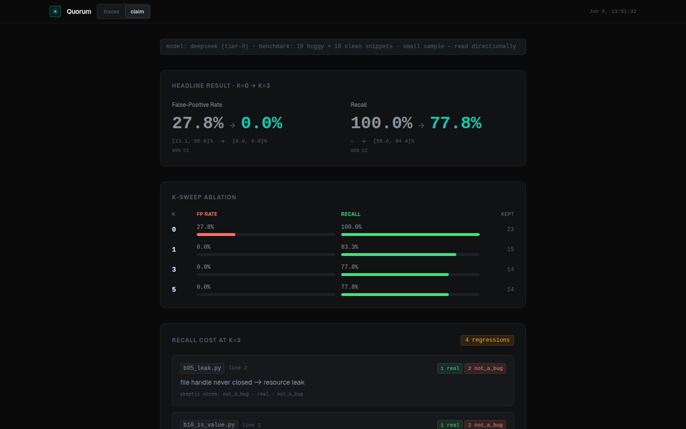
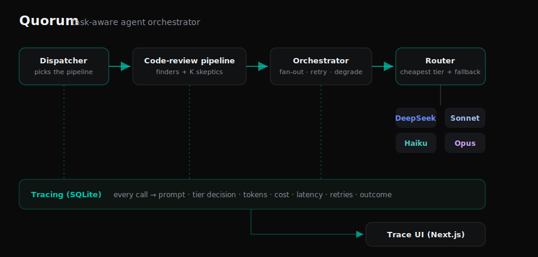

# Quorum

[](https://github.com/thomaspeng/quorum/actions/workflows/ci.yml)

**A task-aware agent orchestrator: cost-aware model routing · adversarial multi-agent verification · every agent call traced · a trace UI that actually looks like a product.**

Quorum is a small, production-shaped substrate for running LLM agents. It routes each
task to the cheapest model tier likely to get it right, verifies findings with K
independent skeptics before trusting them, and records every call (model, tier decision,
tokens, cost, latency, retries, outcome) into a store a clean UI reads back. It proves
itself on **one** real pipeline built to research depth — autonomous code review — and
reports **measured** results, not vibes.



## Headline results

1. **Verification** — K=3 adversarial verification cut the false-positive rate on clean
   code from **27.8% → 0.0%** (95% CI [11.1, 50.0]% → [0, 0]%; recall 100% → 77.8%) on a
   36-snippet labeled bug set (subtle bugs + prompt-injection traps), using DeepSeek.
   Reproducible offline: `make eval-dry`.
   ([methodology + ablation](docs/writeup.md#1-claim-2--adversarial-verification-cuts-false-positives))
2. **Generalization** — on a held-out, unseeded real-world module it found **3/3 genuine
   bugs with 0 surviving false positives** (1 false candidate refuted by verification).
   ([held-out](docs/writeup.md#1b-held-out-target-generalization))
3. **Routing** — tiered routing (DeepSeek → Haiku → Sonnet → Opus) holds task success at
   a fraction of all-Opus cost. Harness + benchmark are committed; the live multi-tier
   number is operator-gated on an `ANTHROPIC_API_KEY`
   ([reproduce](docs/writeup.md#2-claim-1--tiered-routing-holds-quality-at-lower-cost)).

> Numbers are produced by `evals/run_evals.py` and committed under `evals/results/`.
> Nothing is fabricated; the routing live number awaits a key and says so.

## Run it

```bash
python -m venv .venv && . .venv/bin/activate
pip install -e ".[dev]"

make test          # full kernel + pipeline test suite — zero network
make eval-dry      # reproduce the verification table from committed fixtures — zero cost
make pipeline-demo # run the code-review pipeline on a demo target (offline fakes)
```

See the trace UI:

```bash
make export                       # SQLite traces -> ui/public/traces.json
cd ui && npm install && npm run build && npx serve out   # static, no backend
```

Live runs (paid, opt-in) are gated and documented in [docs/writeup.md](docs/writeup.md):

```bash
export ANTHROPIC_API_KEY=sk-ant-...      # routing claim
source your-deepseek-env                  # OSSLLM_API_KEY for the verification claim
QUORUM_EVAL_LIVE=1 make eval-live          # prints a cost estimate before any paid call
```

## Architecture



- **`core/router.py`** — cost-aware tier selection with a fallback ladder (escalate on
  rate-limit/error) and a concurrency cap. Routing policy is a pure, swappable function.
- **`core/orchestrator.py`** — parallel fan-out, retry-with-backoff, idempotency, and
  graceful degradation: one agent failing never fails the run.
- **`core/tracing.py`** — every call is a span in a run tree, persisted to SQLite.
- **`core/dispatcher.py`** — thin intent classifier that picks the pipeline for a target.
- **`pipelines/code_review/`** — finders fan out over a target; each candidate finding is
  refuted by K perspective-diverse skeptics; only majority-survivors are kept.
- **`evals/`** — labeled benchmarks + a dry-run-by-default harness that reproduces the
  headline numbers (with bootstrap CIs and an audit of bugs verification dropped).
- **`ui/`** — a static Next.js + Tailwind trace viewer: run list, agent decision tree,
  token/cost timeline, per-tier cost breakdown, failure→recovery markers, and a **Claim**
  view that renders the measured result.

## Design choices

- **One mockable model interface** (`core/model_client.py`) so the whole spine is tested
  with zero paid calls and dry-run evals replay recorded fixtures deterministically.
- **Dry-run by default + a hard cost gate** — live evals need `QUORUM_EVAL_LIVE=1`, print
  an estimate before the first paid call, and refuse runs over `QUORUM_EVAL_MAX_USD`.
- **Graceful degradation, demonstrated** — `make` target aside, run
  `python -m pipelines.code_review.pipeline --fault-demo`: tier-0 rate-limits, the router
  recovers via fallback to Haiku, the run still succeeds (visible in the UI).
- **Untrusted-input aware** — finder/skeptic prompts treat code under review as data and
  ignore injected instructions; two benchmark snippets test this directly.
- **Fail loud** — missing keys and unpriced models raise; a dry-run never silently falls
  back to a live or empty response.
- **Quality-gated** — `ruff` + `mypy` clean; CI runs lint + types + tests + the offline
  eval on every push.
- **Scope discipline** — one pipeline built deep beats three half-built ones. The
  dispatcher is thin; the `research` pipeline is a registered seam, intentionally unbuilt.

## Repo layout

```
core/        router · orchestrator · tracing · dispatcher · model clients · pricing
pipelines/   code_review/  (finder · verifier · pipeline · prompts · schema)
evals/       benchmark/ (36 bugs + routing) · holdout/ · fixtures/ · run_evals.py · grade.py · results/
ui/          Next.js static trace viewer (Traces + Claim views)
docs/        writeup.md (methodology + ablations) · architecture.svg · assets/
tests/       58 tests, no network
.github/     CI (ruff · mypy · pytest · offline eval · UI build)
```

Built phase-by-phase — see `git log`. Tech: Python 3.10+ (stdlib + `anthropic` + `httpx`),
SQLite, Next.js 15 + React + Tailwind v4.
